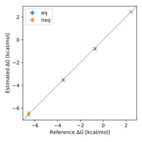

# Reproducibility

While every effort has been made to ensure the 'correctness and reproducibility' of any
results computed using this framework, achieving consistent free energies between
different frameworks and simulation engines has been notoriously tricky
[@loeffler2018reproducibility].

In an attempt to ensure that this framework remains at least self-consistent between
versions, and as consistent as possible with other packages, a suite of regression tests
are provided in the main [GitHub repository](https://github.com/SimonBoothroyd/absolv/).

These include tests to ensure that computing the free energies using both the
'equilibrium' and 'non-equilibrium' methods supported in this framework are in agreement
amongst themselves, and with the GROMACS values reported by Loeffler *et al*
[@loeffler2018reproducibility].

## Regression Results

The results of running the free energy comparisons using the latest version of the
framework are shown below:

<figure markdown>
  { width="100.0%" }
  <figcaption>The average hydration free energies of methane, methanol, toluene, and
              2-cyclopentanylindole computed using the 'equilibrium' and
              'non-equilibrium' methods across three replicas. The error bars show the
              standard deviation computed across three replicas.
  </figcaption>
</figure>

\bibliography
