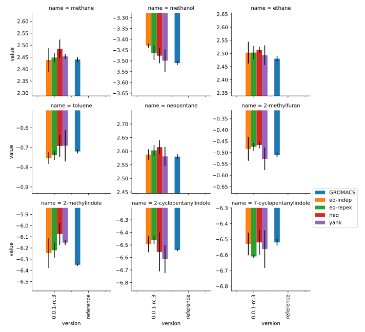

Reproducibility
===============

While every effort has been made to ensure the 'correctness and reproducibility' of any results computed using
this framework, achieving consistent free energies between different frameworks and simulation engines has been
notoriously tricky :cite:`loeffler2018reproducibility`.

In an attempt to ensure that this framework remains at least self-consistent between versions, and as consistent as
possible with other packages, a suite of regression tests are provided in the main `GitHub repository <https://github.com/SimonBoothroyd/absolv/>`_.

These include tests to ensure that:

* the energies of systems that been alchemically modified are consistent with the original system
* systems that contain custom non-bonded force are alchemically transformed in the exact same was
  as systems that contain the built-in OpenMM LJ non-bonded force

and most importantly, that computing the free energies using both the 'equilibrium' and 'non-equilibrium' methods
supprted in this framework are in agreement amongst themselves, with values computed using `Yank <https://github.com/choderalab/yank>`_,
and with the GROMACS values reported by Loeffler *et al* :cite:`loeffler2018reproducibility`.

Regression Results
------------------

The results of running the free energy comparisons using the latest version of the framework are shown below:

Here the error bars show the standard deviation computed across three replicas.

References
----------

.. bibliography:: reproducibility.bib
    :cited:
    :style: unsrt
