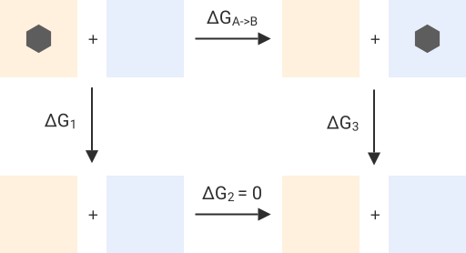
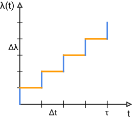

# Theory

The change in free energy of transferring a solute from one solvent to another $\Delta G_{A->B}$, can be readily
computed by constructing a thermodynamic cycle in which the solute in each solvent is alchemically transformed into a
non-interacting state as shown below:

<figure markdown>
  { width="500" }
</figure>

Namely,

$$
\Delta G_{A->B} = \Delta G_1 - \Delta G_3
$$

where here $\Delta G_1$ and $\Delta G_3$ are the change in free energy of alchemically transforming a solute (or perhaps
multiple solutes in the case of charged molecules with counter ions) so that it no longer interacts with the surrounding
corresponding 'solvent'.

Computing the solvation (/ hydration) free energy is a special case of this cycle when the first 'solvent' is vacuum.

This framework currently offers two routes to computing such a change in free energy as the solute is being alchemically
transformed, a more commonly used 'equilibrium route' and a 'non-equilibrium' route.

???+ note

    For more information about how the different inter- and intramolecular interactions are alchemically modified see
    the [transformations][] page.

## Equilibrium Calculations

Within this framework we refer to free energy calculations that involve dividing the alchemical pathway into discrete
windows at each value of the coupling parameter $\lambda$, collecting equilibrium samples for each such discrete state,
and using these samples to compute the free energy using an approach such as thermodynamic integration (TI)
[@straatsma1992computational], BAR [@bennett1976efficient], and MBAR [@shirts2008statistically] as 'equilibrium' free
energy calculations.

At present `absolv` does not offer functionality for computing the derivatives with respect to lambda
required for TI, and only supports MBAR and technically BAR although this estimator is not recommended.

See the [overview][] for more information on running equilibrium free energy calculations using `absolv`.

## Non-equilibrium Calculations

Within this framework we refer to free energy calculations that proceed by generating equilibrium configurations at both
end states (with the solute fully interacting with the solute and with the solute-solvent interactions fully decoupled /
annihilated), and then driving each configuration non-reverisbly along the alchemical pathway by scaling the coupling
factor $\lambda$ as a function of time [@ballard2012replica,dellago2014computing].

From a practical perspective it is computationally more efficient and convenient to proceed along the alchemical pathway
in a stepwise, rather than continuous fashion. More specifically, the protocol proceeds by making a perturbation to
$\lambda$, followed by several relaxation steps, and repeating these two sub-stebs until the alchemical transformation
is complete.

<figure markdown>
  { width="70.0%" }
</figure>

in this way the required to transform the solute from the interacting to the non-interacting state and likewise from the
non-interacting to the interacting state can be computed according to

$$W = \sum_{i=0}^{n-1} \left[u_{\lambda_{i+1}}\left(x_i\right) - u_{\lambda_{i}}\left(x_i\right)\right]$$

where here $u_{\lambda_i}\left(x_i\right)$ is the reduced potential evaluated at configuration $i$ and $\lambda_i$.

The free energy is then estimated by solving

$$\sum^N_{i=1}\dfrac{1}{1+\exp(\beta(W^f_i-\Delta F))} = \sum^N_{i=1}\dfrac{1}{1+\exp(\beta(W^r_i+\Delta F))}$$

self consistently where $W^f_i$ corresponds to work computed along the forward pathway going from the interacting to the
non-interacting state and $W^r_i$ to work computed along the reverse pathway going from the non-interacting to the
interacting state. $N$ refers to the total number of equilibrium snapshots that were generated at each end state.

\bibliography
